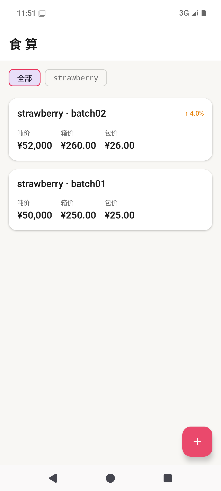

# 食算 — 工厂食品成本换算工具

> 专为食品工厂一线人员设计：把实验室小批量成本，逐级换算成吨价、箱价、包价。

## 核心功能

- **成本换算链路**：实验室小样成本 → 克单价 → 吨价（×1,000,000）→ 箱价 → 包价
- **批次管理**：每次实验/试产记录一条，实时计算成本
- **成本差异对比**：同产品批次间自动标注涨跌幅（↑/↓ 百分比）
- **产品筛选**：按产品名过滤批次列表
- **统计页**：产品吨价排名、成本波动 TOP5、月度汇总
- **物理动效**：按压弹簧回弹、卡片错峰弹性入场

## 技术栈

- Kotlin + Jetpack Compose
- Room（本地数据库，完全离线）
- Navigation Compose
- MVVM + Repository 架构

## 数据模型

| 实体 | 说明 |
|------|------|
| BatchRecord | 批次记录（样品重量、原料成本、加工费） |
| UnitConfig | 换算配置（每箱克数、每箱包数） |
| Ingredient | 原料档案（产地/供应商/保质期等特性） |
| BatchResult | 批次成果（口感/颜色/pH/评分） |
| BatchProblem | 问题记录（分类/严重度/解决方案） |
| BatchSnapshot | 版本快照（防丢，可回溯历史版本） |
| OperationLog | 操作日志（审计追踪） |

## 构建

```bash
./gradlew assembleDebug
# APK 输出: app/build/outputs/apk/debug/app-debug.apk
```

## 截图



## 许可

MIT License
